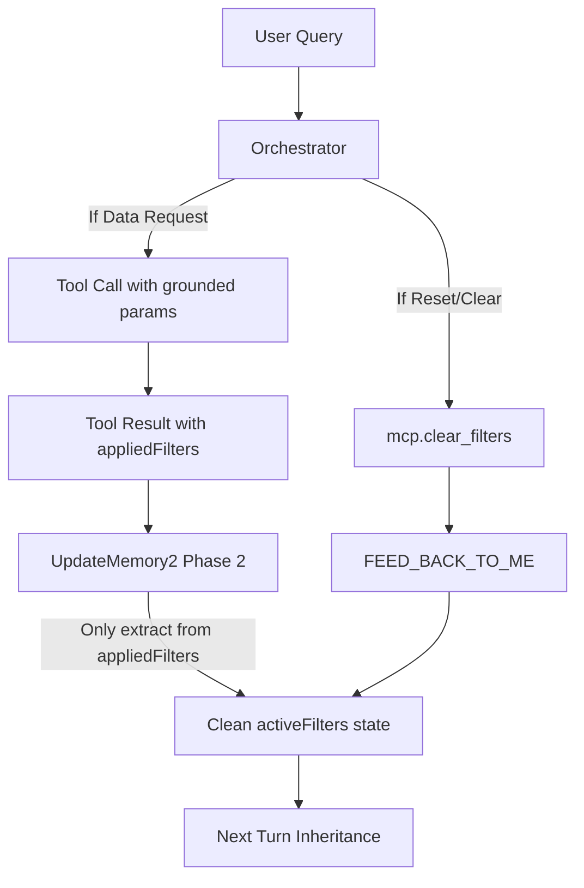

# Handover 4: Hardening MCP Diagnostic Retrieval

## 1. The Core Issue
Users reported that queries like "show me blocked jobs org wide" returned 0 results even when blocked jobs existed in the database.

### Confirmed Root Causes (from live session analysis)

1. **Filter Hallucination** — At Turn 14, the AI ran two `maintenance.query_blocked_jobs` calls with `blockageReason=crew_unavailable` and `blockageReason=part_unavailable`. The user never asked for these specific reasons. The AI *guessed* them.
2. **Filter Stickiness** — At Turn 15, `UpdateMemory2`'s Phase 2 LLM saw these guessed values mentioned in its context and committed `blockageReason=shore_support_or_class_approval` into `activeFilters`. From that point on, every blocked-jobs query used this hallucinated filter, returning nothing.
3. **Silent Shadow Check** — The tool-side Shadow Check ran and correctly detected "0 items returned; 1 other blocked job exists in this scope." However, the `toolSummaryLines` in `UpdateMemory2` stripped the hint before it reached the Phase 2 LLM, so the AI never saw the broader count.

---

## 2. Debugging Flow (Stem to Stern)

### Step A: Find the Thread ID
```bash
npx tsx scripts/find_latest_thread.ts 2>/dev/null
```

### Step B: Trace the Conversation Turn by Turn
```bash
npx tsx scripts/debug_session_history.ts <THREAD_ID>
# Or in one line:
npx tsx scripts/debug_session_history.ts $(npx tsx scripts/find_latest_thread.ts 2>/dev/null)
```

### Step C: Checklist — What to Look For
| Turn | What to Inspect | Red Flag |
|------|-----------------|----------|
| Early turns | `Filters: (none)` | Normal — no filters yet |
| Tool call turn | `• tool: 0 items [blockageReason=X]` | Hallucinated filter being used |
| After tool call | `Filters: {..., blockageReason=X}` | Stale filter committed to memory |
| Shadow Check turn | `⚠ Shadow: 0 items with filters [X]; N other records exist` | AI doesn't see this if bridge was broken |
| Later turns | `0 items` with same stale filter | Retrieval failure from filter stickiness |

---

## 3. What Was Fixed (Phase 1 — Session Prior to This Handover)

### Tool-Side Diagnostic Resilience (`PhoenixCloudBE/services/mcp.service.js`)
- Added generic `shadowCheckHint()` helper (line ~124): factual-only, no imperative language
- Applied to `queryBlockedJobs`, `getMaintenanceExecutionHistory`, `getMaintenanceReliability`
- Shadow Check result surfaced in `summary` (string tools) or `summary.diagnosticHint` (object-summary tools)

---

## 3. What Was Fixed (Phase 2 — Previous Session)

### 1. Internal Diagnostic Payload Recognition (`update_memory2.ts`)
- **Fix 1 — Loop Breaking**: Updated `toolSummaryLines` status detection to recognize internal Skylark diagnostic tools (like `mcp.query_active_filters` and `mcp.clear_filters`) that return state rather than an `items` array.
- **Why?**: Previously, Phase 2 classified these as `0 items (empty)`, causing infinite loops.

### 2. Deterministic Filter Clearing (`mcp.clear_filters`)
- Implemented `mcp.clear_filters` in `execute_tools.ts`. Mutates `workingMemory` in-place without hitting the backend.
- Added hard rule to **Section IX** of `orchestrator_rules.ts` — AI MUST call the tool, not answer conversationally.

### 3. Anti-Hallucination Guardrails (Ground Truth Enforcement)
- Phase 2 LLM (`update_memory2.ts`) is forbidden from extracting attribute filters (blockageReason, failureCode, triggerOrigin) not verbatim in the tool's `appliedFilters` return.
- Updated `getParameterDescription` in `contract.ts` for ALL critical filters.
- Added `tool_unavailable` to the `blockageReason` enum in `ActivityWorkHistory` model.


## 4. What Was Fixed (Phase 3 — Current Session)

### 1. Robust Request Cycle Isolation (`requestCycleId`)
- **Problem**: BSON size pruning in MongoDB was causing the orchestrator's `startTurnIndex` to drift, making it believe no tools had run when in fact they had (causing spurious loops or skips).
- **Fix**: Introduced `requestCycleId` state channel. Each HTTP request gets a unique UUID. All tool results are tagged with this ID. Filtering is now done by ID match, not by array index slicing.
- **Files**: `state.ts`, `workflow.ts`, `orchestrator.ts`, `execute_tools.ts`.

### 2. Discovery Stall Guard Hardening
- **Fix 1 — Precedence Guard**: Prevented `clarifyingQuestion` output from stomping the guard's loop-back verdict. If the guard forces `FEED_BACK_TO_ME`, the LLM's question is suppressed for one turn to allow resolution to complete.
- **Fix 2 — Ambiguity Bail-out**: The stall guard now yields if `hasUnresolvedAmbiguity` is true. This breaks the dead-end loop when a label (like 'CCCCCCC') matches multiple entity types but no single canonical ID exists to retrieve with.

### 3. Ambiguity Prompt Bridge
- **Fix**: The `ambiguityStr` prompt block was previously dead code (defined but never injected into `memoryContext`). It is now active.
- **Hard Rule**: Injected a `MANDATORY ACTION` instruction into the prompt: when ambiguities exist, the LLM MUST set `clarifyingQuestion` + `SUMMARIZE` instead of attempting further tool calls.

---

## 5. Ground Truth Enums Reference

| Parameter | Valid Enum Values |
|-----------|-------------------|
| `blockageReason` | `waiting_parts`, `waiting_ptw`, `waiting_manpower`, `waiting_shore_support`, `waiting_class`, `tool_unavailable` |
| `repairType` | `permanent`, `temporary`, `interim` |
| `triggerOrigin` | `planned`, `form_finding`, `class_observation`, `manual`, `temporary_fix_followup` |
| `severity` | `critical`, `major`, `moderate`, `minor` |
| `statusCode` | `overdue`, `upcoming`, `completed`, `open`, `cancelled`, `rescheduled`, `missed`, `created` |
| `failureCategory` | `mechanical`, `electrical`, `human`, `structural`, `electronic`, `other` |

---

## 6. Debugging Scripts Reference

| Script | Usage | Purpose |
|--------|-------|---------|
| `scripts/find_latest_thread.ts` | `npx tsx scripts/find_latest_thread.ts` | Get the thread_id of the most recent chat session |
| `scripts/debug_session_history.ts` | `npx tsx scripts/debug_session_history.ts [thread_id]` | Raw turn-by-turn analysis — every checkpoint with filters, tools, item counts, insight |
| `scripts/debug_chat_analysis.ts` | `npx tsx scripts/debug_chat_analysis.ts [thread_id]` | **Conversation-level health analysis** — groups turns into conversations, gives PASS/HITL/WARN/LOOP/FAIL verdict + Health Score |
| `scripts/debug_activity_join.ts` | `npx tsx scripts/debug_activity_join.ts` | Diagnoses the Activity→Machinery joinThrough pipeline — raw DB matches, type mismatches, scoping failures |

### `debug_chat_analysis.ts` — Verdict Legend

| Verdict | Meaning |
|---------|----------|
| `✅ PASS` | Tools returned data; AI gave a substantive answer |
| `🔶 HITL` | AI asked a clarifying question (ambiguity or dead-end) |
| `⚠️ WARN` | AI answered but all tools returned 0 items — check filters or data |
| `🔁 LOOP` | Same tool+params fired 3+ times — orchestrator loop bug |
| `❌ FAIL` | Hit iter=8 hard cap with no answer |

### One-liner to analyse the latest chat
```bash
npx tsx scripts/debug_chat_analysis.ts $(npx tsx scripts/find_latest_thread.ts 2>/dev/null)
```

---

## 7. Architecture Notes

### Internal vs External Tool Contracts
- **Internal tools** (`mcp.query_active_filters`, `mcp.clear_filters`, `mcp.resolve_entities`) → defined in `SkylarkAI/backend/src/mcp/capabilities/contract.ts`.
- **External tools** → defined in `PhoenixCloudBE/constants/mcp.capabilities.contract.js`.
- Internal tools are intercepted in `execute_tools.ts` to mutate state directly.

### Filter Safety Chain


---

## 8. Phase 5: Deterministic Failure Retrieval & Memory Integrity

### 9.1. Schema-Level Projection (Failure Visibility)
- **Problem**: `query_status` (`getMaintenanceStatus`) stripped `failureCode` and `failureCategory` in a final projection whitelist.
- **Fix**: Updated three projection stages in `PhoenixCloudBE/services/mcp.service.js` to retain these fields.
- **File**: `mcp.service.js` lines ~1672-1743, ~1800-1827, ~7824-7894.

### 8.2. The AWH Drill-Down Rule (Canonical Referencing)
- **Problem**: AI was querying `maintenance.query_execution_history` using `activityID` (returns most recent committed record, not the specific open job).
- **Fix**: Every item in `query_status` now exposes an `awhID` field. Contract updated: must use `activityWorkHistoryID` for drill-down, not `activityID`.

### 8.3. Orchestrator Constitutional Rules (Anti-Veto Protocol)
- **Rule 11 (SummaryBuffer Veto Prohibition)**: AI forbidden from using past "not found" summaries to skip tool calls.
- **Rule 12 (Pending Intents Mandate)**: If `pendingIntents` is non-empty, `tools: []` is a protocol violation.
- **File**: `SkylarkAI/backend/src/langgraph/prompts/orchestrator_rules.ts`

### 8.4. Memory Integrity (Buffer Sanitization)
- `[MEMORY_BLOCK]` tags were leaking into `longTermBuffer`.
- Fix script: `SkylarkAI/backend/scripts/fix_longterm_buffer.ts`.

### 8.5. Ground Truth Diagnostic Tools
- Script: `SkylarkAI/backend/scripts/check_failure_query.ts` — bypasses AI, reads LangGraph checkpoint (BSON) directly.
- Used to confirm AWH `69e1b95ab0dca34120af4880` has `failureCode: "SER"`, `failureCategory: "external"`.

---

## 9. Phase 6: PMS Diagnostic Analytics — Competency Gap Hardening

### 9.1. Unified Training Service (`crew.query_training_maps`)

**Problem**: The tool only queried the `FailureCodeTrainingMap` collection (admin-defined org-wide policies). If the org had not seeded any policy for a failure code (e.g. `SER`), the tool returned 0 items and the AI reported "no training found" — even though crew had logged competency signal gaps on actual AWH records.

**Fix** (`PhoenixCloudBE/services/mcp.service.js`, `queryTrainingMaps` function):
- Now performs **two parallel queries**: `FailureCodeTrainingMap` (policy) + `ActivityWorkHistory` (AWH records with `impliedCompetencySignalIDs`).
- AWH competency signal IDs are bulk-resolved to human-readable labels via `CrewCompetencySignal` collection.
- Full signal metadata is now fetched: `label`, `signalID`, `sections` (`["certificates","trainingRecords","medicalRecords"]`), `mapsToRequirementIDs` (STCW qualifications).
- Both sources are **merged into the `items[]` array** (tagged `source: "policy"` or `source: "awh_observed"`).
- The `awhObservedGaps` top-level field is preserved for backward compat, but `items` is now the canonical union.

**Why this matters**: The Summarizer pipeline reads ONLY `result.items[]` at line 135 of `summarizer.ts`. Any data returned in non-`items` top-level fields is invisible to the AI. This was the original "no training found" bug.

### 9.2. AWH-Level Competency Hydration (`maintenance.query_status`)

**Problem**: `query_status` returned `impliedCompetencySignalIDs` as raw ObjectId strings — not human-readable labels.

**Fix** (`mcp.service.js`, `getMaintenanceStatus`):
- After fetching AWH records, bulk-resolves `impliedCompetencySignalIDs` from the `CrewCompetencySignal` collection in a single query.
- Returns `impliedCompetencyGaps: [{ label, signalID, sections, mapsToRequirementIDs }]` inline on each status item.
- This means the AI sees competency gaps **without needing to call a secondary tool**.

### 9.3. `crew.query_competency_config` — Added Filter Params

**Problem**: `getCrewCompetencyConfig` accepted only `organizationID` and `limit`. When a user asked "tell me more about Tanker Management training", the AI correctly recognized that calling this tool would return ALL signals for the org — not the specific one asked about — and chose to answer from memory instead.

**Fix** (`mcp.service.js`, `getCrewCompetencyConfig`):
- Added optional `signalLabel` (case-insensitive partial match) and `signalID` (exact match) filter params.
- AI can now call `crew.query_competency_config?signalLabel=Tanker+Management` for a targeted lookup.

**Contract update** (`contract.ts`, `mcp.capabilities.contract.js`):
- `optionalQuery` updated to include `signalLabel`, `signalID`.
- `whenToUse` clarified: use when user asks for details on a named signal.
- `interpretationGuidance` added: always report `sections` and `mapsToRequirementIDs` to the user.

### 9.4. MCP Pipeline Visibility Fix — Comprehensive Pass

**The universal bug**: The Summarizer reads only `result.items[]`. Any tool returning meaningful data in other top-level fields is completely invisible to the AI.

**Audit of all tools** — found and fixed 4 additional offenders:

| Tool | Data Hidden From AI | Fix |
|------|--------------------|----|
| `inventory.query_part_alternatives` | `part`, `substitutes`, `crossReferences` — no `items` at all | Added `items[]` as union of primary part + substitutes with `type` discriminator |
| `fleet.query_structures` | `sfi`, `components` — no `items` | Added `items[]` merging both with `type: "sfi"` / `type: "component"` |
| `search.query_metadata` | `savedSearches`, `tags` — no `items` | Added `items[]` with `type: "saved_search"` / `type: "tag"` |
| `crew.query_competency_config` | `signals` — no `items` | Added `items: signals` alias |

**File**: `PhoenixCloudBE/services/mcp.service.js`

**Important**: Named fields are preserved for backward compat. Only `items[]` is added as the canonical union.

---

## 10. ⚠️ UNRESOLVED: The `direct_query_fallback` Dead Path

### What `direct_query_fallback` is

`direct_query_fallback` (`SkylarkAI/backend/src/mastra/tools.ts`, line 9) is a semantic search + MongoQL query engine powered by `serviceBackedPhoenixRuntimeEngine.processUserQueryStream`. It performs natural-language-to-MongoDB query translation and is designed to answer queries that no specific MCP tool covers, or to retry after an MCP tool fails.

**Activation paths** (from `orchestrator_rules.ts` Section IV.4 Failback Management):
1. **Direct pick**: Orchestrator explicitly chooses `direct_query_fallback` as the first tool when no structured MCP tool fits the query.
2. **Safety net**: After an MCP tool returns empty/error (with `FEED_BACK_TO_ME`), the Orchestrator sees the failure and calls `direct_query_fallback` as the next tool.

### Why it is NOT firing for competency/training detail requests

**Symptom observed** (from live logs):
```
[LangGraph Orchestrator Output] {
  "tools": [],
  "feedBackVerdict": "SUMMARIZE",
  "reasoning": "This is a text-only follow-up asking for more explanation about a training recommendation already present in memory..."
}
[Workflow Route] ⏭️ D2 skipped — no new tools ran this request (Orchestrator reused memory)
```

**Root cause** — a 3-factor confluence:

**Factor 1 — `pendingIntents` is empty after training map call**

In `update_memory2.ts` Phase 2, after `crew.query_training_maps` returns `1 item`, the LLM marks the training intent as `SATISFIED` and sets `pendingIntents: []`. It does not know that `sections` and `mapsToRequirementIDs` are a second-tier detail the user will want next. The Phase 2 LLM only sees `"1 items returned"` in its tool summary — which looks complete.

**Factor 2 — Rule 1 Conversational Exception fires incorrectly**

With `pendingIntents: []`, when the user asks "tell me more about Tanker Management", the Orchestrator applies Rule 1's Conversational Exception:
> *"ONLY if the user asks a purely text-based follow-up... whose answer already exists verbatim in your memory, you may skip tools."*

The `summaryBuffer` already has a prior INSIGHT about "Tanker Management with 1 occurrence". The Orchestrator classifies "tell me more" as a text explanation request, not a data request. This is superficially correct — there's no count, no date, no status — but it's architecturally wrong because the full signal detail (sections, qualification mappings) has NEVER been fetched.

**Factor 3 — `direct_query_fallback` has no entry point**

`direct_query_fallback` can only activate if:
- The Orchestrator chooses it in `tools[]`, OR
- An MCP tool is called first (with `FEED_BACK_TO_ME`) and fails, giving the Orchestrator a turn to see the failure and choose `direct_query_fallback` next

Since `tools: []` was returned, `execute_tools` never ran. There is no failure to react to. `direct_query_fallback` is structurally unreachable.

**Execution trace**:
```
Turn N:   crew.query_training_maps → {label:"Tanker Management", occurrences:1} returned
          update_memory2 Phase 2: "1 item → intent SATISFIED" → pendingIntents: []

Turn N+1: User asks "tell me more about Tanker Management"
          pendingIntents=[] → Rule 12 cannot fire
          summaryBuffer has prior answer → Rule 1 Conversational Exception fires
          tools: [] → execute_tools never enters → direct_query_fallback unreachable
          Summarizer: answers from memory (no new data)
```

### What the correct fix looks like (next agent's task)

**Constraint from the owner**: No case-by-case tool-specific injection (like the rejected Phase 1.5 approach that checked specifically for `crew.query_training_maps`). The fix must be **architectural and generic**.

**The correct approach**: Fix the `direct_query_fallback` trigger path so it activates properly when a user asks a detail question about data that was partially retrieved. There are two valid architectural options:

**Option A — Teach `update_memory2` Phase 2 that "returned items with structured IDs ≠ fully satisfied"**

Update the Phase 2 LLM system prompt in `update_memory2.ts` (line 481) with a generic rule:

> *"If a tool returned items that contain reference IDs (fields ending in `ID`, `Ids`, or named `signalID`, `competencyID`, etc.) that point to detail records NOT yet fetched in this turn, the retrieval intent is NOT fully satisfied. Add a `pendingIntent` indicating the detail fetch is still needed. This applies generically to any tool that returns reference pointers — not just training maps."*

This is **LLM-driven and generic** — it doesn't hardcode any tool name. Phase 2 LLM determines what constitutes "partially retrieved" based on whether items contain unfetched reference IDs.

**Option B — Fix the `direct_query_fallback` invocation mandate**

Currently, the Failback Mandate (Section IV.4) says:
> *"If a specialized MCP tool returns an error or empty result, you MUST attempt `direct_query_fallback`."*

This only covers empty/error. It does NOT cover the case where a tool returns partial data (items with label only, no detail). Extend the mandate:

> *"If a tool returned items but the user's follow-up question requests detail that was NOT present in the returned items (e.g. asking for sections, qualifications, or full metadata about an entity only identified by label), you MUST call the appropriate detail tool or `direct_query_fallback` — NOT answer from memory. Items containing only labels/names with no detail fields (sections, mappings, descriptions) are PARTIAL results, not complete ones."*

**Recommendation**: Implement **Option A** first (update Phase 2 system prompt — low risk, no code logic change) and validate with the training detail query. If that's insufficient, layer Option B (extend the Failback Mandate in orchestrator_rules.ts).

**Key constraint**: Do NOT inject tool-specific logic (checking for `crew.query_training_maps` by name) into `update_memory2.ts`. This creates fragile case-by-case branching that will need to be repeated for every new tool that has reference IDs.

---

## 11. Files Changed This Session (Phase 6)

### `PhoenixCloudBE/services/mcp.service.js`
| Function | Change |
|----------|--------|
| `queryTrainingMaps` | Dual-source: policy + AWH-observed gaps. Full signal hydration (signalID, sections, mapsToRequirementIDs). Both sources merged into `items[]`. |
| `getMaintenanceStatus` | AWH `impliedCompetencySignalIDs` bulk-resolved to full signal detail inline. |
| `getCrewCompetencyConfig` | Added `signalLabel` and `signalID` optional filter params for targeted lookups. |
| `getPartAlternatives` | Added `items[]` as union of primary part + substitutes (previously no `items`). |
| `getFleetStructures` | Added `items[]` merging `sfi` + `components` (previously no `items`). |
| `getSearchMetadata` | Added `items[]` merging `savedSearches` + `tags` (previously no `items`). |

### `SkylarkAI/backend/src/mcp/capabilities/contract.ts`
- `crew.query_competency_config`: Added `signalLabel`, `signalID` to `optionalQuery`. Updated `whenToUse`, `interpretationGuidance`, `responseShape`.
- `crew.query_training_maps`: Updated `responseShape` and guidance to reflect dual-source + full signal metadata.
- `maintenance.query_status`: Guidance updated to reflect inline `impliedCompetencyGaps`.

### `PhoenixCloudBE/constants/mcp.capabilities.contract.js`
- Synchronized with SkylarkAI contract changes.

---

## 12. Summary of Critical Files

| File | Purpose |
|------|---------|
| `PhoenixCloudBE/services/mcp.service.js` | Primary backend MCP service — all tool implementations |
| `SkylarkAI/backend/src/langgraph/prompts/orchestrator_rules.ts` | Orchestrator behavioral rules (12 rules currently) |
| `SkylarkAI/backend/src/langgraph/nodes/update_memory2.ts` | Memory node — Phase 1 (code) + Phase 2 (LLM) |
| `SkylarkAI/backend/src/langgraph/nodes/summarizer.ts` | Reads `items[]` ONLY from tool results — critical constraint |
| `SkylarkAI/backend/src/mastra/tools.ts` | Tool definitions including `direct_query_fallback` |
| `SkylarkAI/backend/src/mcp/capabilities/contract.ts` | Internal tool contracts |
| `PhoenixCloudBE/constants/mcp.capabilities.contract.js` | External tool contracts (BE-side) |
| `PhoenixCloudBE/models/crew.competency.signal.model.js` | `CrewCompetencySignal` schema: `signalID`, `label`, `sections`, `mapsToRequirementIDs`, `isActive` |
| `PhoenixCloudBE/models/failure.code.training.map.model.js` | Org-admin policy: failure code → training requirement mappings |

---

## 13. Phase 7: Hardening Intelligent Retrieval Fallbacks

### 14.1. Deterministic Fallback Guardrails (`orchestrator.ts`)

**Problem**: The LLM was unreliable at signaling a fallback when specialized MCP tools returned 0 items. It would often attempt to `SUMMARIZE` a "no results found" message instead of retrying with semantic search.

**Fixes**:
- **`EMPTY RESULT FALLBACK GUARD`**: A code-level safety net that detects when (1) all retrieval tools in the cycle returned 0 items, (2) the LLM intends to `SUMMARIZE`, and (3) `direct_query_fallback` hasn't run yet. It auto-injects the fallback tool.
- **`FALLBACK DEDUP GUARD`**: Prevents the AI from looping on the fallback tool. Strips redundant `direct_query_fallback` calls if the tool already completed once in the current request cycle.
- **One-Shot Rule**: Added to `orchestrator_rules.ts` to inform the AI that semantic fallback is a one-shot-per-cycle capability.

### 14.2. Timeout Optimization (`execute_tools.ts`)

**Problem**: `direct_query_fallback` is a multi-step pipeline (Keyword Extraction → Ambiguity Resolution → RAG → Mongo Generation → Execution → Enrichment). Complex fleet-wide aggregations regularly took 30–45s, causing them to be killed by the global 25s tool timeout.

**Fix**:
- Implemented **per-tool timeouts**.
- `direct_query_fallback` now has a **90s limit**.
- All other MCP tools retain the **25s safety limit**.
- Error messages now dynamically report the actual timeout value used.

---

## 14. Phase 8: Phoenix Direct Query Engine (Hardening RAG & Generation)

### 15.1. Failure Domain Date Rule (`prompts.ts`)

**Problem**: The Mongo query generator was inconsistently picking `plannedDueDate` (a scheduling field) for ActivityWorkHistory date filters. In failure tracking, `plannedDueDate` is often null or irrelevant; the actual event timestamp is in `latestEventDate`. This caused "0 items found" despite valid data existing.

**Fix**: Added a **CRITICAL rule** to `AMBIGUITY_RESOLVER_SYSTEM_PROMPT` in `phoenixai/prompts.ts` (~line 239):
> *"For date range filtering on failure/work history queries, ALWAYS use latestEventDate (the actual event execution timestamp), NEVER plannedDueDate."*

### 15.2. The `$toString` Safety Bug (`prompts.ts`)

**Problem**: To prevent crashes, the generator wraps `$toString` in a `$type` check: `['string','double','int','long','decimal','bool','date']`. However, it **omitted `objectId`**. Since MongoDB `_id` fields are `ObjectId`, every attempt to join a name (e.g., "Fleetships") to an ID failed because the `$cond` returned `""` for the ID side.

**Fix**: Updated `QUERY_GENERATION_SYSTEM_PROMPT` (~line 318) to include `objectId` in the mandatory safety list. This restored Organization/Vessel resolution for all semantic queries.

---

## 15. Key Architectural Invariants (Updated)

1.  **Summarizer reads `items[]` only** — No change.
2.  **`direct_query_fallback` is one-shot** — Enforced by `FALLBACK DEDUP GUARD`.
3.  **Tiered Timeouts** — Fallback = 90s, MCP = 25s.
4.  **Date Filtering Ground Truth** — Failure queries = `latestEventDate`.
5.  **Join Safety** — `$toString` MUST include `objectId` in `$type` checks.

---

## 16. Phase 9: Hardening Phoenix Direct Query Retrieval (Orchestrator-to-Phoenix Bridge)

### 17.1. Deterministic Context Bridge (`tools.ts`)

**Problem**: The `direct_query_fallback` tool was "context-blind". The Phoenix AI Engine was forced to re-resolve entities (Organizations, Vessels) using expensive natural language `$lookup` stages, even though the Orchestrator already had these IDs in its `workingMemory`.

**Fix** (`mastra/tools.ts`):
- The `direct_query_fallback` tool now extracts `workingMemory` from its context.
- Constructs a normalized `sessionData` payload: `organizationID`, `vesselID`, `isBroadScope`, `activeFilters`.
- **SecondaryScope Resilience**: Groups focused entities by `modelType` into arrays (e.g., `machineryIDs: []`, `componentIDs: []`) to prevent overwriting when multiple entities of the same type are in focus.

### 17.2. Ambiguity Resolver Hardening (`executor.ts` & `prompts.ts`)

**Strategy**: Leverage the Ambiguity Resolver to "digest" the session context and output a deterministic natural language request for the Query Generator.

**Fixes**:
- **Context Injection** (`executor.ts`): The `sessionData` is injected as a labeled JSON block into the Ambiguity Resolver's dynamic context.
- **Constitutional Rules** (`prompts.ts`): Added a **Highest Priority Session Context block** to `AMBIGUITY_RESOLVER_SYSTEM_PROMPT`.
    - **No Over-Asking**: Forbidden from asking clarifying questions for entities already in `session_context`.
    - **ID Embedding**: Explicitly embeds hex IDs into `normalized_request` (e.g., "where organizationID is '651a...'"). This decouples the engine, letting the downstream generator handle the technical mapping.
    - **Broad Scope**: Respects `isBroadScope: true` to explicitly override vessel-specific filters.

### 17.3. MongoDB Type-Safe ID Matching (`prompts.ts`)

**Problem**: MongoDB aggregations fail if a string `"651..."` is queried against an `ObjectId` field. Some Skylark collections (like `AWH`) store `organizationID` as a String, while others use `ObjectId`.

**Fix**: Added **Session ID Type Safety** rule to `QUERY_GENERATION_SYSTEM_PROMPT`:
> *"Use the ID provided, but cast it (or don't) strictly according to the schema type for that target field. Consult the injected collections schema to decide between $expr+$convert vs plain string equality."*

### 17.4. Critical Cache Collision Fix (`executor.ts`)

**Problem**: The `ambiguityPromptHash` previously only hashed the `userQuery`. Identical questions in different vessel contexts (e.g., "how many open jobs?") would hit the same cache entry, returning stale data from the wrong vessel.

**Fix**: Updated `ambiguityPromptHash` calculation to include `JSON.stringify(sessionData)`. Any change in the Orchestrator's resolved scope now correctly busts the Phoenix cache.

---

## 17. Updated Architectural Invariants

1.  **Context Bridge**: Orchestrator `workingMemory` is the Single Source of Truth for entity IDs in fallback queries.
2.  **Schema-Aware Generation**: The Query Generator must NEVER assume a 24-character hex ID is an `ObjectId` without checking the `collections` schema.
3.  **Cache Integrity**: Prompt hashes must include session context to prevent cross-scope data leaks.

---

## 18. Phase 10: Advanced Crew Competency Diagnostics (Signal Completions & Gap Analysis)

### 19.1. The "Tanker Management" Discovery Gap

**Problem**: Competency signals (e.g., "Tanker Management") were not resolvable via `mcp.resolve_entities` because they use string `signalID`s (tags) on the `CrewMember` records rather than database ObjectIds. This prevented the AI from accurately querying who has completed a specific competency.

**Architectural Strategy**: 
1.  **Discovery Step**: Treat `crew.query_competency_config` as the discovery tool for signals (equivalent to `resolve_entities` for vessels).
2.  **Diagnostics Tool**: Introduce a purpose-built `crew.query_competency_diagnostics` tool to perform high-fidelity completion and gap analysis in a single aggregation pipeline.

### 19.2. Backend Implementation (`PhoenixCloudBE`)

**New Tool**: `getCrewCompetencyDiagnostics` (`mcp.service.js`):
- **Aggregation logic**:
    - Resolves the signal document (by label or ID) to fetch `signalID`, `sections` (records required), and `mapsToRequirementIDs`.
    - Joins `CrewMember` with `CrewAssignment` to correctly scope results to the active crew of a specific vessel (since `CrewMember` lacks a root `vesselID`).
    - Filters the member's `certificates`, `trainingRecords`, and `medicalRecords` arrays for entries matching the `signalID`.
    - JS-side post-processing calculates `missingSections` (Gaps) and `isFullyCompliant` status.
- **Contract Update** (`mcp.capabilities.contract.js`):
    - Exposed `signalLabel` and `signalID` on `crew.query_competency_config` (previously hidden).
    - Registered the new `crew.query_competency_diagnostics` capability with detailed instructions.
- **Plumbing**: Wired through `mcp.controller.js` and `mcp.route.js`.

### 19.3. AI Orchestration Strategy (`SkylarkAI`)

**Tooling Alignment** (`contract.ts`):
- Mirrored the backend contract changes to enable the AI to see the new `signalLabel` parameters and the new diagnostic tool.

**Resolution Logic**:
- **Protocol Rule**: When a user asks about a named competency signal (e.g., "Tanker Management"), the AI is taught (via tool `whenToUse` guidance) to:
    1.  Call `crew.query_competency_config` to resolve the signal metadata (sections, tags).
    2.  Call `crew.query_competency_diagnostics` with the resolved `signalID` and `vesselID` to fetch completions and gaps.
- **Special Case**: `crew.query_competency_diagnostics` also supports `signalLabel` directly, allowing the backend to handle the resolution internally in a single turn for common cases.

### 19.4. Summary of Data Points Surfaced

- **Completions**: A list of specific certificates/records per crew member that fulfill the signal requirement.
- **Gap Analysis**: A `missingSections` array (e.g., `["medicalRecords"]`) explicitly stating what the crew member is missing.
- **Compliance Stats**: Org/Vessel-wide summary counts (`fullyCompliantCount`, `partiallyCompliantCount`, `nonCompliantCount`).

### 🚦 Verification & Reliability

- **Type Safety**: The backend ensures that even if a signal name is passed (e.g., "tanker management"), it uses a case-insensitive regex for resolution.
- **Performance**: The aggregation pipeline uses indexed `organizationID` and `employmentStatus` filters before the `$lookup` join to maintain low latency even in large organizations.

---

## 19. Updated Architectural Invariants (Batch 10)

1.  **Competency Single Source of Truth**: `signalID` is the canonical tag string used to bridge `CrewCompetencySignal` definitions and `CrewMember` records.
2.  **Vessel Scoping**: All crew-related vessel filters MUST proceed via a join with the `CrewAssignment` collection.
3.  **Signal Resolution**: Named training/competency requests MUST use `query_competency_config` or `query_competency_diagnostics`, bypassing the generic `mcp.resolve_entities`.
## 20. Phase 11: Orchestrator Hardening & Sequenced Multi-Part Tasks

### 21.1. The "Resolution Hijack" Problem
**Problem**: In multi-part queries like *"clear the filters and show me Tanker Management completions"*, the Orchestrator's **Strategic Intercept** logic would see "Tanker Management" as an unclassified label and hijack the turn to run `mcp.resolve_entities`. 
- Since "Tanker Management" is a string signal tag (not a database ID), resolution would fail.
- The failure would trigger the **Discovery Stall Guard** or a dead-end clarifying question, preventing the user's intent to clear filters or run the actual competency query.

### 21.2. Generic Strategic Intercept Bypass (`orchestrator.ts`)
**Fix**: Implemented a two-tier bypass for the Strategic Intercept to ensure deterministic execution of meta-tools and correctly routed parameters.

1. **Atomic Meta-Tool Bypass**: `mcp.clear_filters` and `mcp.query_active_filters` are now categorized as **Atomic Diagnostic Tools**. If they are planned, the intercept is bypassed to ensure state changes happen first.
2. **Direct Parameter Bypass (Generic)**: If the LLM has already assigned an unclassified label as a string value in ANY planned tool argument (e.g., `signalLabel="Tanker Management"`, `searchTerm="Main Engine"`), the intercept is bypassed.
   - **Principle**: If the LLM has made a routing decision to use the label as a direct parameter, the Orchestrator respects that decision instead of forcing a resolution pass.
   - **Benefit**: This is fully generic and works for all current and future tools without hardcoding tool names.

### 21.3. Contract-First Reasoning Hardening
**Fix**: Updated tool contracts in `SkylarkAI` and `PhoenixCloudBE` to provide explicit "Contract-First" guidance to the LLM.

- **Tool**: `crew.query_competency_diagnostics`
- **Change**: Added a ⚠️ warning to `whenToUse`: *"You MUST pass the string name directly into the signalLabel parameter. Do NOT treat the signal name as an unclassified entity, and do NOT attempt to resolve it to an ID first."*
- **Result**: The LLM now correctly identifies "Tanker Management" as a direct parameter rather than an entity needing resolution, causing the generic bypass in 21.2 to trigger.

### 21.4. Multi-Intent Determinism
**Scenario Verified**: *"clear the filters and then show me current filters and then show me which crew members have completed Tanker Management training and when"*
- **Turn 0**: Orchestrator plans `mcp.clear_filters`, `mcp.query_active_filters`, and `crew.query_competency_diagnostics` in parallel/sequence.
- **Outcome**: The Strategic Intercept is bypassed because `mcp.clear_filters` is atomic AND "Tanker Management" is already handled as a direct `signalLabel` arg. 
- **Summary**: User receives the filter reset confirmation and the real competency data in a single turn.

---

## 21. Phase 12: Sequential Execution Hardening & UI Determinism

### 23.1. The Problem: Non-Deterministic Tool Execution in Multi-Part Filter Chains

**Core trigger**: A user says *"show me completed activities for XXX1 for this year, then reset filter and show me for past year only"*. This query has a **state-mutating step in the middle** (`mcp.clear_filters`). If the two retrieval calls run **in parallel** (via `Promise.all`), the second retrieval can start before the filter reset completes, returning stale data from the wrong date window.

**Root cause confirmed**: The LLM response object already contained a `parallelizeTools: false` intent field, but it was **never registered as a LangGraph state channel**. This meant the flag was silently dropped between the Orchestrator node (which set it) and the `execute_tools` node (which needed to read it). The `execute_tools` node always fell back to `Promise.all()`.

---

### 23.2. Fix 1: Register `parallelizeTools` as a LangGraph State Channel

**File**: `SkylarkAI/backend/src/langgraph/graph.ts`

**Change** (lines ~94–98): Added `parallelizeTools` to the `StateGraph` channel definitions with a `LastValue` reducer (last writer wins — always Orchestrator's most recent decision):

```typescript
parallelizeTools: {
    value: (prev: boolean | undefined, next: boolean | undefined) =>
        next !== undefined ? next : (prev !== undefined ? prev : true),
    default: () => true,
},
```

**Why critical**: Without this, the Orchestrator writes `parallelizeTools: false` to its return object, but LangGraph has no channel for it, so it is stripped before the state reaches `execute_tools`. With the channel registered, the flag persists across node boundaries.

---

### 23.3. Fix 2: `parallelizeTools` Schema & Orchestrator Logic

**File**: `SkylarkAI/backend/src/langgraph/state.ts`

Added `parallelizeTools?: boolean` to the `SkylarkState` interface.

**File**: `SkylarkAI/backend/src/langgraph/nodes/orchestrator.ts`

- The LLM response schema already had a `parallelizeTools` field. The Orchestrator now reads it and commits it to the state via `updates.parallelizeTools`.
- **Strategic Intercept reset**: When the Strategic Intercept fires (to run `mcp.resolve_entities` or `mcp.clear_filters` as a meta-turn), `parallelizeTools` is reset to `true` (parallel is safe for single-tool turns). This prevents a stale `false` from a previous turn from accidentally serializing single-tool intercept turns.
- **Final commit variable** (`finalParallelizeTools`): Captures the resolved value so the return path always has a clean flag.

---

### 23.4. Fix 3: Sequential Execution Branch in `execute_tools.ts`

**File**: `SkylarkAI/backend/src/langgraph/nodes/execute_tools.ts`

**Change**: Extracted tool execution into `executeSingleTool()` helper. Added branching:

```typescript
if (state.parallelizeTools === false) {
    // Sequential for...of loop — each tool awaits the previous
    for (const toolCall of activeCalls) {
        const result = await executeSingleTool(toolCall, index);
        executedResults.push(result);
    }
} else {
    // Parallel Promise.all() — existing behavior
    const results = await Promise.all(activeCalls.map(...));
    executedResults.push(...results);
}
```

**Why**: With `for...of` + `await`, if tools are ordered `[mcp.clear_filters, maintenance.query_status(this year), maintenance.query_status(past year)]`, the second retrieval does not start until the filter is reset. This eliminates the stale-data race condition.

---

### 23.5. Fix 4: Orchestrator Rule 14 (LLM Guidance)

**File**: `SkylarkAI/backend/src/langgraph/prompts/orchestrator_rules.ts`

Added **Rule 14** to teach the LLM when to set `parallelizeTools: false`:

> *"If ANY tool in the planned list mutates shared state (mcp.clear_filters, mcp.set_filters, mcp.update_active_filters), set `parallelizeTools: false`. The execution engine will run them sequentially in the order listed. If no tool mutates state, set `parallelizeTools: true` (default). ORDER MATTERS: always put state-mutating tools first."*

This is the key mechanism: the LLM understands natural language ("reset filter and then...") and can detect mutating steps. The flag it outputs is then deterministically enforced by the execution engine.

---

### 23.6. Fix 5: UI Empty Tab Suppression Bug

**File**: `SkylarkAI/frontend/src/components/new-ui/ResultTable.tsx` (line ~341)

**Problem**: If a retrieval tool returned 0 rows, the UI tab for that query was silently dropped — the user had no way to know whether the tool ran at all or produced no data.

**Old logic**:
```typescript
.filter((result) => result.rows.length > 0)
```

**New logic**:
```typescript
.filter((result) => result.rows.length > 0 || !!result.uiTabLabel)
```

**Why**: The LLM supplies a `uiTabLabel` for every explicitly planned query (e.g., "Completed Activities – This Year"). If rows are 0 but the tab is labeled, it means the query was intentional. Showing "No data found" in an explicitly labeled tab is better UX than silently dropping it — the user can see the tool ran with the correct filter and returned no results (which is a valid, informative answer).

---

### 23.7. Fix 6: EMPTY RESULT FALLBACK GUARD — False Positive Fix

**File**: `SkylarkAI/backend/src/langgraph/nodes/orchestrator.ts` (lines ~886–910)

**Problem**: The guard checked `requestCycleToolResults.some(turn => ...)` — meaning **any** turn in the request cycle that had a 0-item result would trigger the guard and inject `direct_query_fallback`.

**False positive scenario**:
1. Turn 24: `mcp.query_active_filters` → returns state object (no `items` array, evaluates as "empty")
2. Turn 25: Entity resolution
3. Turn 26: 3× `maintenance.query_status` → all return real data
4. LLM correctly returns `tools: []` + SUMMARIZE (Turn 26 data is in context)
5. Guard fires because Turn 24 was "empty" → injects `direct_query_fallback` → causes ambiguity

**Fix**: Changed to check only the **LAST retrieval turn**, not any turn:

```typescript
const isNonDiscoveryRetrievalKey = (k: string) =>
    !isDiscoveryKey(k) && !k.includes('direct_query_fallback') && !k.startsWith('mcp.');

const lastRetrievalTurn = [...requestCycleToolResults].reverse().find(turn =>
    Object.keys(turn || {}).some(k => isNonDiscoveryRetrievalKey(k))
);

const hasEmptyRetrievalResult = lastRetrievalTurn
    ? Object.entries(lastRetrievalTurn).some(([k, res]) => {
        if (!isNonDiscoveryRetrievalKey(k)) return false;
        let data: any = res;
        if (data?.content?.[0]?.text) { try { data = JSON.parse(data.content[0].text); } catch {} }
        return Array.isArray(data?.items) ? data.items.length === 0 : false;
    })
    : false;
```

**Also**: Explicitly excludes `mcp.*` keys (clear_filters, query_active_filters) since these are state management tools, not data retrieval tools. Their "empty" return should never trigger the fallback guard.

---

### 23.8. Fix 7: Ambiguity HITL Bridge (`execute_tools.ts`)

**File**: `SkylarkAI/backend/src/langgraph/nodes/execute_tools.ts` (line ~272)

**Problem**: When `direct_query_fallback` returns `__ambiguity_stop: true`, the graph exits immediately via `graph.ts`'s routing function (`return "__end__"`). The **next HTTP request** (user's clarification answer) arrives with:
- `isHITLContinuation: false` (never was set for this path)
- `iter = 0`, so `isNewQuery = (0 <= 1) && !false = true`
- `update_memory2` resets Tier 2 (rawQuery, pendingIntents) because `isNewQuery = true`
- LLM now sees the clarification answer as a **fresh query topic** and misinterprets it

**Concrete failure**: After ambiguity stop on *"show me completed activities for XXX1 for this year, then reset filter and show me for past year only and then show me the same for MV Phoenix Demo"*, the next request ran `maintenance.query_status` for `XXX1 + 2024` (wrong vessel, wrong year) instead of `MV Phoenix Demo + this year` which was the `pendingIntents` item.

**Fix**: When the ambiguity stop return is built (line 272), add `isHITLContinuation: true`:

```typescript
return {
    toolResults: outputs,
    messages: [...state.messages, new AIMessage({ content: finalMessageContent })],
    // 🟢 AMBIGUITY HITL BRIDGE: Tell the next HTTP request that the user is answering
    // a clarifying question, not starting a fresh query.
    isHITLContinuation: true,
} as any;
```

**Effect**: Next HTTP request has `isHITLContinuation: true` → `isNewQuery = false` → Tier 2 is preserved → `rawQuery` and `pendingIntents` are intact → Orchestrator executes the pending intent (MV Phoenix Demo) correctly.

---

### 23.9. Update Memory2 Band-Aid Reverts

**File**: `SkylarkAI/backend/src/langgraph/nodes/update_memory2.ts`

Previous sessions had added temporary "band-aid" fixes that manually cleared or reset filter context to prevent stale-data poisoning. These were removed because the new deterministic sequential pipeline (Fix 1–4 above) handles the ordering problem properly at the execution layer, making the band-aids unnecessary and potentially harmful.

---

### 23.10. Architecture Overview (Phase 12)

```
User Query: "show me completed X for this year, reset filter, show past year, then MV Phoenix Demo"
                          │
                    [Orchestrator Node]
                          │
              LLM produces parallelizeTools: false
              tools: [mcp.clear_filters, query_status(year1), query_status(year2), query_status(vessel2)]
                          │
                    [graph.ts state channel]
                    parallelizeTools = false ✅ (now persists)
                          │
                  [execute_tools Node]
                          │
              state.parallelizeTools === false?
                          │
                    ┌─────▼──────┐
                    │ for...of   │  ← Sequential, guaranteed order
                    │ await each │
                    └─────┬──────┘
                          │
              [clear_filters] → [query_status year1] → [query_status year2] → [query_status vessel2]
                          │
                   All results in state
                          │
              EMPTY RESULT FALLBACK GUARD (checks last retrieval turn only)
                          │
              if last turn has data → no fallback injection
                          │
                    [Summarizer]
                          │
              4 tabs rendered (with empty tabs shown if uiTabLabel present)
```

---

### 23.11. Files Changed in Phase 12

| File | Change |
|------|--------|
| `backend/src/langgraph/graph.ts` | Registered `parallelizeTools` as a LangGraph state channel with `LastValue` reducer |
| `backend/src/langgraph/state.ts` | Added `parallelizeTools?: boolean` to `SkylarkState` interface |
| `backend/src/langgraph/nodes/orchestrator.ts` | Reads/commits `parallelizeTools`; Strategic Intercept resets to `true`; EMPTY RESULT FALLBACK GUARD now checks last retrieval turn only (not any turn) |
| `backend/src/langgraph/nodes/execute_tools.ts` | Extracted `executeSingleTool()` helper; added sequential `for...of` branch when `parallelizeTools === false`; added `isHITLContinuation: true` to ambiguity stop return |
| `backend/src/langgraph/nodes/update_memory2.ts` | Removed temporary filter-poisoning band-aid patches |
| `backend/src/langgraph/prompts/orchestrator_rules.ts` | Added Rule 14 (sequential execution mandate for state-mutating tool chains) |
| `frontend/src/components/new-ui/ResultTable.tsx` | Changed tab filter to retain labeled (uiTabLabel) tabs even with 0 rows |

---

### 23.12. Known Remaining Issues / Watch Points for Next Agent

1. **`direct_query_fallback` ambiguity False Positives**: The ambiguity engine in the Phoenix Direct Query layer may still trigger for legitimate single-vessel queries that are underspecified. The bridge fix (23.8) prevents this from *losing state*, but if the user genuinely provides an ambiguous query to the Phoenix engine, the clarification flow still pauses execution. This is by-design but the UX of "waiting for clarification" for queries that the MCP tools could have answered is suboptimal.

2. **Post-Ambiguity Pending Intent Execution**: After the HITL bridge fix, the next request will correctly preserve `pendingIntents`. BUT the Orchestrator must be correctly reading and executing from `pendingIntents` rather than re-interpreting the user's clarification answer as the primary query. Rule 12 (Pending Intents Mandate) enforces this — verify in live testing that the LLM follows it when `isHITLContinuation: true` is present.

3. **`mcp.query_active_filters` Evaluated as "Empty"**: The EMPTY RESULT FALLBACK GUARD now excludes `mcp.*` keys, but `mcp.query_active_filters` returns a state object that doesn't have an `items` array. Verify this exclusion is working as expected in production logs.

4. **Sequential Status Message**: The workflow route (`routes/workflow.ts`, line 86) emits "Executing N Parallel Tools..." for all execute_tools runs. When `parallelizeTools === false`, it should say "Executing N Sequential Tools..." — cosmetic issue, low priority.

### 23.13. Fix 8: Summarizer Context Enrichment (Generic `appliedFilters`)

**File**: `SkylarkAI/backend/src/langgraph/nodes/summarizer.ts`

**Problem**: When a tool returned 0 results, the Summarizer previously received only the tool key (e.g., `maintenance.query_status_iter1_5`). Because there were no data rows in the flattened result table to provide evidence, the LLM would hedge its summary with phrases like *"prior-year result remains unconfirmed"*—even though the tool actually ran and returned a confirmed empty set.

**Fix**: Enriched the `emptyTools` metadata passed to the Summarizer by serializing the full `appliedFilters` object and any `uiTabLabel`.

```typescript
const filterContext = af && Object.keys(af).length > 0
    ? ` Applied filters: ${JSON.stringify(af)}.`
    : '';
emptyTools.push(`- **${key}** (${capability})${labelContext}: Returned 0 matching items.${filterContext} This is a CONFIRMED EMPTY result — the query ran successfully with these exact filters and found no matching records. State this explicitly in your summary.`);
```

**Why**: This provides the LLM with the "ground truth" of the query's intent (e.g., vesselID, dates). The LLM can now confidently state: *"No completed activities were found for MV Phoenix Demo in 2025,"* providing better closure to the user.

---

### 23.14. Fix 9: Temporal Awareness (Current Date Injection)

**File**: `SkylarkAI/backend/src/langgraph/nodes/orchestrator.ts`

**Problem**: The LLM lacked awareness of the actual current date, leading it to default to 2025 as "this year" based on its training data bias. This caused incorrect date-range tool arguments (e.g., querying 2024 for "past year" when it should be 2025).

**Fix**: Injected today's date and relative year definitions directly into the `SESSION CONTEXT` header of the prompt.

```typescript
const today = new Date();
const todayStr = today.toISOString().split('T')[0]; // e.g. "2026-04-19"
const currentYear = today.getFullYear();           // e.g. 2026
const priorYear = currentYear - 1;                 // e.g. 2025

// Injected at top of SESSION CONTEXT:
`📅 TODAY: ${todayStr} | Current Year: ${currentYear} | Prior Year: ${priorYear}\nWhen the user says "this year" use ${currentYear}. When they say "past year" or "prior year" use ${priorYear}.`
```

**Why**: This eliminates LLM guessing. All relative time expressions ("last 30 days", "prior year", "next month") are now anchored to the physical system clock.

---

## 22. Updated Architectural Invariants (Batch 12)

1. **Sequential Execution**: Any tool chain containing a state-mutating tool (`mcp.clear_filters`, etc.) MUST set `parallelizeTools: false`. This is enforced by Rule 14 (LLM instruction) + the state channel (code enforcement).
2. **EMPTY RESULT FALLBACK GUARD**: Only fires when the **last retrieval turn** returns empty. State-management tools (`mcp.*`) are excluded from this check.
3. **Ambiguity HITL Bridge**: When `direct_query_fallback` triggers an ambiguity stop, `isHITLContinuation: true` is persisted in state so the next HTTP request preserves `rawQuery` and `pendingIntents`.
4. **Empty Tab Visibility**: A UI tab is ALWAYS rendered if the LLM provided a `uiTabLabel`, regardless of row count. "No data found" is a valid, informative result.
5. **Summarizer Confidence**: The Summarizer must be provided with `appliedFilters` for empty results so it can definitively report 0-match outcomes for specific entities/dates rather than hedging.
6. **Temporal Determinism**: The Orchestrator must always be injected with the current system date to ensure correct interpretation of relative time filters.
7. **LangGraph Channel Registration**: Any flag that the Orchestrator sets that must survive to the next node MUST be registered as a state channel in `graph.ts`. Unregistered fields are silently dropped.


## 23. Phase 13: Hardening Competency Diagnostic Pipelines & Entity Resolution

### 25.1. The "Phase 11" Orchestrator Bypass (Eliminated)

**Problem**: A generic bypass in `orchestrator.ts` (`allUnclassifiedHandledAsArgs`) was silencing the Strategic Intercept whenever an unclassified label appeared as any tool argument. This allowed misrouted labels (e.g., a vessel name like "XXX1" placed in `activityDescription`) to silently skip resolution. Since the downstream tools could not match "XXX1" against a description field, the query would return 0 results without the AI ever realizing it missed an entity.

**Fix** (`orchestrator.ts`):
- **Deleted** the `allUnclassifiedHandledAsArgs` block entirely. 
- The Strategic Intercept now has exactly **one bypass path**: atomic meta-tools (`mcp.clear_filters`, `mcp.query_active_filters`) that mutate session state.
- **Result**: Every unclassified entity label — vessel, machinery, or competency signal — is now forced through `mcp.resolve_entities` to obtain a canonical ObjectId before being passed to retrieval tools.

### 25.2. Unified Resolver for Competency Signals

**Problem**: `CrewCompetencySignal` was previously handled as a special case where labels were passed directly to tools (`signalLabel`). This deviated from the "Resolve-First" architecture used for Vessels and Machinery, leading to resolution failures when signals were mixed with other entities.

**Fix** (`lookup_logic.ts`):
- Registered `CrewCompetencySignal` in `RESOLVABLE_ENTITIES` (searches `label` and `signalID`).
- Added to `COLLECTIONS_WITH_ACTIVE_FLAG` with explicit mapping for the `isActive` field (as this collection uses `isActive`, not `active`).
- **Result**: Signals are now standard resolvable entities. `mcp.resolve_entities(entityType='CrewCompetencySignal')` returns a 24-char ObjectId.

### 25.3. Service-Side Hardening (`PhoenixCloudBE`)

**Fix** (`mcp.service.js`, `getCrewCompetencyDiagnostics`):
- Refactored to accept `competencySignalID` (ObjectId) as the primary lookup key.
- Resolves the internal string `signalID` tag via `findOne({ _id })`.
- Removed `signalLabel` support from the AI-driven path to enforce deterministic resolution.

### 25.4. Contract-First Enforcement (`contract.ts`)

**Changes**:
- **`activityDescription`**: Added a ⚠️ CRITICAL warning: *"NEVER pass a vessel name, vessel code, or machinery name here."*
- **`competencySignalID`**: Added parameter description with the resolve-first mandate.
- **`crew.query_competency_diagnostics`**: Updated to require `competencySignalID` (ObjectId). Removed "pass string directly" guidance.

### 25.5. Hardened Discovery Stall Guard (Signal-Driven Termination)

**Problem**: The Discovery Stall Guard was capped at `iter === 1`. In sessions where stale observational memory (e.g., "no records found" from a prior turn) fooled the LLM into thinking work was done, it would attempt to `SUMMARIZE` at `iter=2` with no retrieval tools. The guard would stand down, and the query would fail.

**Fix** (`orchestrator.ts`):
- **Removed the iteration cap**. The guard now fires solely based on **code-level signals**:
    - `prevTurnWasDiscovery === true`
    - `hasRetrievalInCurrentRequest === false`
    - `pendingIntents.length > 0` (The "Unfinished Work" signal)
- **Result**: The Orchestrator will continue to loop back as long as `UpdateMemory2` reports unfulfilled intents, protected by the graph's hard `maxIter=8` ceiling.

---

## 24. Phase 14: Entity Scope Hardening & Domain Pivot Logic

### 27.1. Entity Scope Contamination (Fixed)

**Problem**: The `currentScope` array (used by the Orchestrator to iterate over fleet vessels) was a flat list of hex IDs with no type awareness. Non-navigable entity IDs (e.g., `CrewCompetencySignal` ObjectIds) were being promoted into this list. This caused the Orchestrator to pass signal ObjectIds as `vesselID` arguments to maintenance tools, leading to "Vessel not found" errors.

**Fix** (`update_memory2.ts`):
- Introduced **`SCOPE_NAVIGABLE_KEYS`**: A deterministic whitelist (`vesselID`, `machineryID`) that defines which entity types drive fleet-level iteration.
- **Filtered Promotion**: Only ObjectIds associated with navigable keys are promoted to `currentScope`. 
- **Preserved Context**: Non-navigable IDs (like `crewcompetencysignalID`) stay in the session scope under their typed keys. They remain available for tools as parameters but can no longer contaminate the fleet vessel list.

### 27.2. Semantic Domain Pivot Signal

**Problem**: The system relied on string comparison (`isGenuineTopicPivot`) to decide whether to clear active filters. This was structurally correct (text changed) but semantically blind. It failed to distinguish between an **entity pivot** (same domain, different vessel) where filters (dates, status) should be kept, and a **domain pivot** (maintenance to competency) where filters must be cleared.

**Fix**:
- **`isDomainPivot` Flag** (`orchestrator.ts`): Added a semantic signal to the Orchestrator schema. The LLM now judges whether the operational domain has changed (e.g., Maintenance → Competency).
- **Domain-Specific Reset** (`update_memory2.ts`): When `isDomainPivot` is true, all domain-specific `activeFilters` (statusCode, dates) are cleared. On entity pivots (`isDomainPivot=false`), these filters are inherited.
- **State Integration**: Registered `isDomainPivot` as a `LastValue` state channel in `graph.ts` and added to the `SkylarkState` interface.

### 27.3. Conversation Turn Integrity (The GAP-4b Fix)

**Problem**: `summarizer.ts` was incorrectly skipping the `summaryBuffer` write and `humanConversationCount` increment whenever a tool returned 0 items (`[]`).
- **Root Cause**: The logic `hasRealData = allItems.length > 0` equated "empty result" with "failed execution."
- **Effect**: Confirmed-empty retrieval turns (e.g., "No competency completions found for XXX1") were silently dropped from the AI's memory. On the next turn, the LLM would have no record of the exchange and revert to stale historical context (e.g., defaulting back to maintenance queries).

**Fix** (`summarizer.ts`):
- Refined `hasRealData` to include `emptyDataset` as a valid conversation turn, provided the tool didn't return a hard error string.
- **Result**: "0 items found" is now a persistent fact in conversational memory, ensuring the AI maintains the correct domain context across turns.

### 27.4. Natural Language Topic Comparison (`isDomainPivot`)

**Problem**: Initial domain pivot logic relied on classifying tool families. This was fragile and non-human.
**Fix** (`orchestrator.ts`):
- Replaced tool-classification logic with a **Natural Language Reading Comprehension** prompt.
- The Orchestrator now explicitly compares the *New Question* vs the *Last Q&A* and asks: *"Is this a natural follow-up to the existing conversation, or is it a completely unrelated topic/domain change?"*
- **Reasoning**: This handles conversational nuances (e.g., switching from Maintenance to Competency) much more reliably than code-level tool lists.

### 27.5. UI Aesthetic Hardening

**Fix** (`AnalyticalSummary.tsx`):
- Added support for `trend-up` (`TrendingUpIcon`) and `refresh-cw` (`RefreshCw`) icons.
- These icons are used to visually confirm "Filter Reset" and "Operational Trend" insights, improving the premium feel of the analytical summaries.


---

## 25. Updated Architectural Invariants (Batch 14)

1.  **Mandatory Resolution**: No retrieval tool may accept a human-readable label for an entity type that exists in `mcp.resolve_entities`. All labels must be resolved to ObjectIds first.
2.  **No Generic Intercept Bypass**: The Strategic Intercept fires for all unclassified labels. Only meta-tools that operate on session state (`mcp.*`) may bypass it.
3.  **Signal-Driven Termination**: The Orchestrator cannot `SUMMARIZE` if (a) the previous turn was a discovery turn and (b) `pendingIntents` is non-empty. This prevents premature termination due to stale observational memory.
4.  **Navigable Scope Isolation**: Only entity types defined in `SCOPE_NAVIGABLE_KEYS` (Vessels, Machinery) can enter the `currentScope` array. This prevents parameter contamination across tool domains.
5.  **Semantic Filter Inheritance**: Filter inheritance is governed by the `isDomainPivot` signal. Filters are inherited across entity pivots in the same domain but strictly cleared when switching domains.
6.  **Field Invariants**: `CrewCompetencySignal` uses `isActive`. Most other collections use `active`. Resolver logic must account for this discrepancy.
7.  **Conversation Persistence**: Every turn that produces a user-facing response — including confirmed empty results (`[]`) — MUST increment the conversation index and be written to the `summaryBuffer`. Skipping turns is only permitted for hard tool errors.
8.  **Natural Topic Detection**: Domain pivot detection MUST use LLM-based reading comprehension (comparing Q to previous Q&A) rather than static tool family lists to handle conversational shifts reliably.

---

## 26. Hardening Memory Persistence & Discovery Intercepts (Batch 15)

### 29.1. Protected Domain Context (The GAP-18 Fix)

**Problem**: During scope expansions (e.g., from "XXX1 competency" to "org-wide competency"), the system exhibited "Context Amnesia." 
- **Root Cause**: `UpdateMemory2` Phase 2 LLM would see a new `rawQuery` ("Organization-wide investigation...") and a discovery tool result (`fleet.query_overview`). Since the new query text didn't explicitly mention "Tanker Management," and the discovery tool didn't return training data, the LLM's **ANTI-POISONING** rule would strip the competency filters (`signalName`, `mode`) to match the "ground truth" of the current turn.
- **Effect**: The system would lose the thread of the investigation and default back to maintenance queries in the next turn.

**Fix** (`update_memory2.ts`):
- Implemented **PROTECTED DOMAIN CONTEXT** injection.
- **Logic**: If `isNewQuery=true` AND `isDomainPivot=false` (confirmed continuation), the previous domain filters are harvested and injected into the Phase 2 prompt as a **MANDATORY** block.
- **LLM Rule**: The LLM is now strictly forbidden from dropping any filter in the "PROTECTED" block. This ensures topic parameters (signalID, mode, statusCode) survive entity and scope pivots.

### 29.2. Mixed-Turn Intercept Hardening

**Problem**: If a user turn mixed meta-tools (like `mcp.clear_filters`) with data retrieval, the **Strategic Intercept** (entity resolution) was occasionally bypassed.
- **Root Cause**: `isAtomicDiagnosticPlanned` used `.some()`, meaning if *any* tool was a meta-tool, the whole turn was treated as atomic.
- **Fix** (`orchestrator.ts`): Changed logic to `.every()`. Now, the Intercept is only bypassed if **all** tools in the turn are atomic meta-tools. If any data-fetching tool is present, entity resolution is guaranteed to trigger.

### 29.3. Data Integrity: Orphaned Vessel Assignments

**Problem**: Crew member "Elena Petrova" (with Tanker Management completions) was not appearing in org-wide competency results.
- **Discovery**: 
    1. Elena's `CrewAssignment` points to `vesselID: 6932a0819a99795799f341bf`.
    2. However, **no such vessel record exists** in the `vessels` collection.
    3. The competency diagnostic aggregation joins on `CrewAssignment` and filters by `vesselID`. Since Elena is assigned to a "ghost" vessel, she is correctly filtered out by the database engine.
- **Lesson**: Data-level orphan records in `CrewAssignment` are the primary cause of "missing data" in the competency pipeline. The AI and MCP logic were confirmed to be behaving correctly.

---

## 27. Hardening Deep Form Discovery (Batch 16)

### 31.1. Decoupling Content Search from Entity Resolution

**Problem**: There was an architectural debate about whether `mcp.resolve_entities` should support searching "inside" form data (answers, comments, values).
- **Decision**: Rejected overloading `resolve_entities`. 
- **Rationale**: `resolve_entities` is a **Discovery** tool (Mapping a known Name/Code → ID). Searching for "the form where I mentioned a fuel leak" is a **Retrieval** task (Content Snippet → Record ID). Conflating them leads to "leaky abstractions" and non-deterministic tool selection.

**Fix**: Implemented a dedicated high-performance retrieval tool: `forms.search_content`.

### 31.2. Implementation: `forms.search_content`

**Tool Definition** (`contract.ts` & `mcp.capabilities.contract.js`):
- **Purpose**: Search within filled form data (answers, field values, comments).
- **Required Parameters**: `organizationID`, `contentTerm`.
- **Optional Parameters**: `vesselID`, `startDate`, `endDate`, `limit`.

**Hardened Logic** (`mcp.service.js`):
1.  **Strict Scoping**: Mandatory `organizationID` check.
2.  **Implicit 3-Month Window**: Defaults to the last 3 months unless explicit `startDate`/`endDate` are provided. This protects MongoDB from expensive collection-wide regex scans.
3.  **100-Record Safety Cap**: Hard limit on results to ensure response payload stability.
4.  **Deep Regex Scan**: Performs a case-insensitive regex match against:
    -   Form `name` and `description`.
    -   All values within the `formData` object (flattened and stringified at runtime).
5.  **Matched Context (`matchedIn`)**: The tool returns exactly *where* the match was found (e.g., `form data field "failureCause"` or `form name`). This allows the AI to explain the result to the user ("I found a match in the 'Comments' field of your Risk Form...").

### 31.3. Discovery Engine Refinement (`lookup_logic.ts`)

**Fix**: Resolved a copy-paste regression in the `DailyMachineryRunningHours` resolvable entity. It was previously using Port Schedule search fields (`searchPortCode`). Fixed to use `machineryName` and `remarks`.

---

## 28. Updated Architectural Invariants (Batch 16)

1.  **Retrieval vs. Discovery**: Search-by-content (keywords inside records) belongs in dedicated retrieval tools (`forms.search_content`). `resolve_entities` is strictly for mapping identifiers (Names, Codes, IMO numbers) to ObjectIds.
2.  **Implicit Safety Windows**: Any tool performing wildcard regex searches across unindexed freeform data (like `formData`) MUST enforce an implicit time-window (default 3 months) to prevent performance degradation.
3.  **Matched-In Transparency**: Retrieval tools should return metadata indicating the matching field. This prevents the "Black Box" effect where the AI presents a record without explaining why it was selected.
4.  **Empty Result Guidance**: When a content search returns 0 items within the implicit window, the response MUST include a `windowNote` advising the user that the search was limited to 3 months and offering an expansion.
5.  **Shared Mongo Lifecycle**: The Discovery Engine (`lookup_logic.ts`) uses a module-level shared MongoClient to prevent connection pool exhaustion during concurrent entity resolutions.
6.  **Alias Mapping Integrity**: LLM-facing entity names (singular PascalCase, e.g., `Form`) must be explicitly mapped to Mongoose-pluralized collection names (`forms`) in the `COLLECTION_ALIAS_MAP` to ensure $or queries hit the correct collection.
7.  **Deterministic Parameter Descriptions**: All new retrieval parameters (like `contentTerm`) must be registered in the `getParameterDescription` switch in `contract.ts` to ensure the orchestrator understands the strict usage requirements (e.g., "This searches content, NOT template names").

## 29. Ambiguity Resolution & Scoping Hardening (Phase 15)

### 33.1. Orchestrator Loop Breaker Hardening (`orchestrator.ts`)
- **Case-Insensitive Label Tracking**: `resolvedLabelSet` is now built with lowercased keys, ensuring the case-insensitive comparison (`lblLower`) works correctly even if the LLM alters the case of the entity label between turns.
- **Ambiguous Session Labels Guard**: Added `ambiguousSessionLabels` to track labels that returned `> 1` matches during `mcp.resolve_entities`. This provides a code-level guardrail preventing the Strategic Intercept from endlessly attempting to resolve genuinely ambiguous labels (e.g. 3 activities matching the same description).

### 33.2. GC Logic Correction (`update_memory2.ts`)
- **Ambiguity Memory Promotion**: Removed a buggy garbage collection block that was prematurely deleting `ambiguousMatches` at `iter=1`. `ambiguousMatches` now survives and reaches the Orchestrator, allowing the `AMBIGUITY DETECTED` prompt block to correctly surface to the LLM, forcing a clarifying question to the user.
- **Deterministic Cleanup**: Stale ambiguity cleanup is correctly handled by the `else { delete }` branch on lines 201-205, which fires cleanly on new requests where no resolve tools are run.

### 33.3. Join-Through Aggregations for Scoping (`lookup_logic.ts`)
- **Generic `joinThrough` Config**: Extended the `RESOLVABLE_ENTITIES` registry to support a `joinThrough` property. This allows entities that lack a direct `organizationID` or `vesselID` foreign key to be scoped by joining through a parent or junction collection via an aggregation pipeline.
- **Activity (Forward Join)**: `Activity` now joins through `Machinery` to inherit the machinery's `vesselID` scoping, heavily reducing false ambiguities during cross-vessel searches.
- **CrewMember (Inverted Join)**: `CrewMember` now utilizes an `inverted` join through `CrewAssignment`. The aggregation starts from `CrewAssignment` (filtered by vessel), groups by `crewMemberID` to deduplicate, and joins the actual `CrewMember` collection, resolving the long-standing gap of CrewMember lacking a root `vesselID`.

### 33.4. UI Aesthetic Hardening (Siri-Inspired Spinner)
- **Premium Loader Transition**: Replaced the basic grey "ping" dot in `ContinuousChatView.tsx` with a premium, Siri/Claude-inspired multi-color spinner.
- **Rich Aesthetics**: Implemented a `conic-gradient` based ring with a `radial-gradient` mask to create a modern, high-end "AI is thinking" visualization that aligns with modern AI interface standards.

